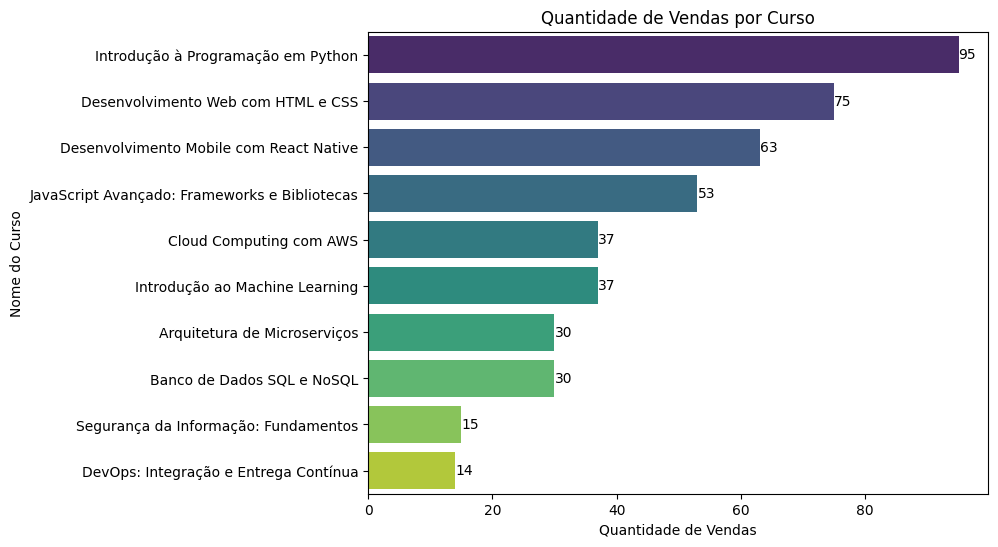

# Análise de vendas de cursos de tecnologia
Neste projeto foi realizado a análise de um conjunto de dados de vendas de cursos de tecnologia, como segue:

## Sobre o conjunto de dados
- **ID:** Identificador único de cada curso vendido.
- **Nome do Curso:** Nome do curso vendido na plataforma.
- **Quantidade de Vendas:** Número de vendas realizadas para cada curso.
- **Preço Unitário:** Preço unitário do curso.
- **Data:** Data da venda do curso.
## Desafios
1. Calcular a receita total gerada pela venda dos cursos.
2. Identificar o curso com o maior número de vendas.
3. Visualizar a distribuição das vendas ao longo do tempo através de gráficos.
## Estrutura
- **data/dados.csv:** Arquivo gerado com os dados propostos no desafio;
- **graficos:** Pasta com os gráficos obtidos durante análise;
- **analise.ipynb:** Jupyter Notebook com os códigos elaborados;
- **requirements.txt:** Arquivo de requisitos especificando as bibliotecas Python necessárias.
## Execução
Para executar o projeto em uma máquina local:
1. Instalar as bibliotecas necessárias:
```bash
pip install -r requirements.txt
```
2. Executar o notebook:
Abrir o arquivo ```analise.ipynb``` e executar as células de código.
## Conlusões e Resultados

### Receita total
A Receita total calculada é de **R$ 32.735,10**.

O resultado foi obtido multiplicando as colunas de 'Preço Unitário' e 'Quantidade de Vendas', resgistrando os resultados em uma nova coluna e usando nela o método ```sum()``` da biblioteca pandas.

### Curso com o maior número de vendas
O curso com o maior número de vendas é o 'Introdução à Programação em Python' seguido por 'Desenvolvimento Web com HTML e CSS' e 'Desenvolvimento Mobile com React Native'



### Distribuição de vendas ao longo do tempo
É possível observar duas datas de pico de vendas, em 01/01/2023 e 20/01/2023, ambas coincidem com dias de venda do curso 'Introdução à Programação em Python'.


### Correlação Preço x Quantidade de Vendas
No gráfico de correlação entre Preço e Quantidade de Vendas é possível observer uma forte  correlação negativa, o que pode ser interpretado como quanto maiores os preços unitários menor é o número de vendas.


